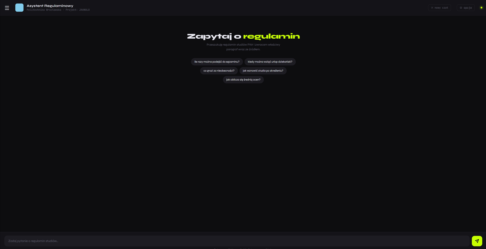
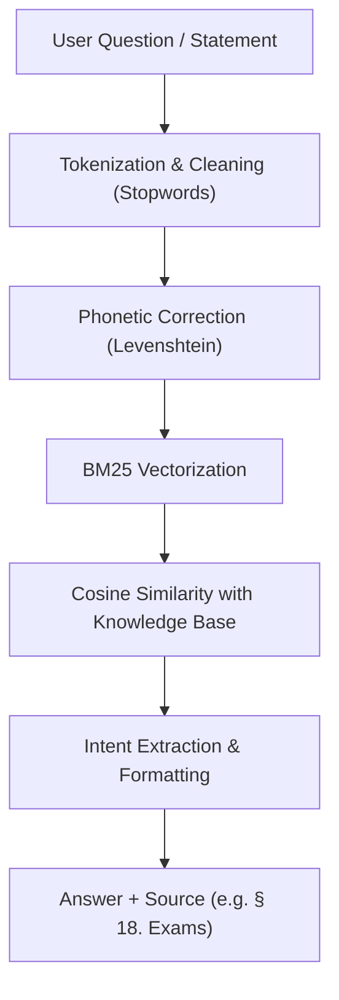
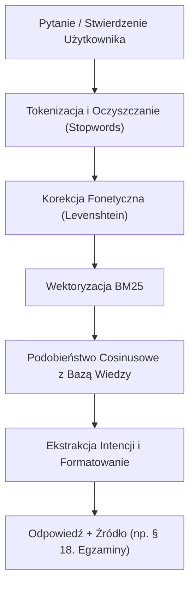

> 🇬🇧 [English](#-pwr-regulatory-assistant) &nbsp;|&nbsp; 🇵🇱 [Polski](#-asystent-regulaminowy-pwr)

---

# 🇬🇧 PWr Regulatory Assistant

> An information retrieval system for the study regulations of Wrocław University of Science and Technology (PWr).
> Unlike classic LLMs that hallucinate — **this system always cites the exact source paragraph**.

An academic project built entirely from scratch — no external NLP libraries (no scikit-learn, no Hugging Face, no external APIs).

---

<p align="center">
  
</p>

## How It Works



### Mathematical Foundations (BM25)
Instead of relying on black-box NLP libraries, the system implements the classic BM25 (Best Match 25) formula from scratch. Hyperparameters control term frequency saturation (`k1`) and document length penalty (`b`), avoiding cosine dilution in long regulatory documents and drastically improving accuracy.

### Affirmative Statements Evaluation
The system supports verifying statements directly. You can prompt: *"Evaluate if this sentence is true: A student has the right to a dean's leave"*. The algorithm filters out the command noise and matches the underlying fact against the exact regulation!

---

## Project Status

### Regulatory Assistant (Active)

The current version of the project is a production-ready information retrieval system.
Instead of generating answers from memory, it uses a **RAG (Retrieval-Augmented Generation)** approach focused on precision.

**Key Features:**
- **BM25 Algorithm from scratch** — optimized for Polish legal texts ([see details in docs/MATEMATYKA.md](docs/MATEMATYKA.md)).
- **Levenshtein Distance** — custom implementation for typo correction.
- **Intent Classifier** — extracts numbers, dates, and consequences from paragraphs.
- **Diagnostics API** — built-in tools for production monitoring and error tracing.
- **Configuration & Hyperparameters** — **47 parameters** fully decoupled into [**`data/config/config.toml`**](data/config/config.toml) for easy tuning (BM25 constants, custom term boosts, static & dynamic chapter weights).
- **Graph Visualization** — view connections between paragraphs directly from the UI.
- **UI Toggles** — flexible control over matching parameters without modifying code.
- **Release History** — track changes in [docs/CHANGELOG.md](docs/CHANGELOG.md).

---

## Quick Start

### Requirements
- Python 3.12+
- Docker (optional)

### Installation

```bash
# 1. Clone the repository
git clone https://github.com/JAANULO/pwr-regulatory-assistant.git
cd pwr-regulatory-assistant

# 2. Install dependencies (Production optimized)
pip install -r requirements.txt
```

### Running Locally

```bash
python app.py
# → open http://localhost:5000
```

### Test Results
| Metric | Value |
|---|---|
| Test suite size | 170 questions |
| Accuracy (correct paragraph & point) | **~98.2%** |
| Response time | < 50 ms |

### Automatic Simulation
The project supports a built-in optimization module with parallel Random Search (utilizing multiple CPU cores). To run the optimizer:
```bash
python scripts/symulacja.py
```
You can customize the simulation using command-line arguments:
*   `--questions <path>`: Path to a custom test questions file.
*   `--max-combos <number>`: Maximum number of parameter combinations to check (default: 50).
*   `--sekcje <names>`: Select specific sections from `testy.toml` (e.g. `testy_latwe testy_trudne`).

Example:
```bash
python scripts/symulacja.py --max-combos 100 --sekcje testy_trudne
```
The simulation tests parameters on the dataset to find the best configuration and saves it in `data/config/optimal/`.

---

## Diagnostics & Admin Tools

The project includes advanced diagnostics for the production environment (e.g., Render):
- **Debug Endpoint**: `/admin/debug?token=YOUR_TOKEN`
- **Error Tracing**: Append `?token=YOUR_TOKEN` to the URL to see full Python tracebacks in the chat UI if an error occurs.

---

## Technologies Used

| Technology | Purpose |
|---|---|
| **Python 3.13** | entire backend |
| **NumPy** | vector operations |
| **pdfplumber** | PDF regulation parsing |
| **Flask** | HTTP server for GUI |
| **SQLite / Postgres** | statistics and feedback storage |

---

## Project Architecture

```
├── docs/                       ← Technical documentation and changelog
│   ├── assets/                 ← Images and graphics
│   └── research/               ← Notes and ideas
├── deployment/                 ← Deployment files (Docker, Gunicorn)
│   ├── Dockerfile
│   ├── .dockerignore
│   └── gunicorn.conf.py
├── app.py                      ← Flask API server
├── core/                       ← Algorithms and settings
├── domain/                     ← Business logic and repositories
├── infrastructure/             ← Loaders and infrastructure
├── static/                     ← Frontend (JS, CSS)
├── templates/                  ← Frontend (HTML)
├── data/                       ← Configs, DBs, Knowledge Bases (SoC)
│   ├── config/                 ← TOML configuration files
│   ├── database/               ← SQLite DB and cache .pkl files (ignored)
│   │   └── sql/                ← SQL schemas and queries (SQLite & Postgres)
│   └── kb/                     ← Knowledge base files (.json, .pdf)
└── tests/                      ← Tests and verification
    ├── unit/                   ← Unit tests (TOML validity, basic scripts)
    └── integration/            ← Integration tests (Flask smoke, regression)
```

---

# 🇵🇱 Asystent Regulaminowy PWr

> System wyszukiwania informacji z regulaminu studiów Politechniki Wrocławskiej.
> Zamiast halucynować jak klasyczne LLM — **zawsze podaje źródłowy paragraf regulaminu**.

Projekt akademicki zbudowany od zera — bez gotowych bibliotek NLP (bez sklearn, bez Hugging Face, bez zewnętrznych API).

---

## Jak to działa



### Podstawy Matematyczne (BM25)
Zamiast korzystać z gotowych bibliotek, system implementuje wzór BM25 (Best Match 25), w którym hiperparametry kontrolują nasycenie częstości słowa (`k1`) oraz karę za długość paragrafu (`b`). Dzięki temu unikamy zjawiska tzw. dilucji cosinusowej przy długich dokumentach, co drastycznie podnosi trafność.

### Ocenianie Zdań Twierdzących
System obsługuje weryfikację twierdzeń. Wpisanie komendy takiej jak *"Oceń czy to zdanie jest prawdziwe: Student ma prawo do urlopu dziekańskiego"* spowoduje odfiltrowanie szumu i precyzyjne dopasowanie samego zdania (faktu) do właściwego paragrafu regulaminu!

---

## Wersje projektu

### Asystent Regulaminowy (Aktywna)
Główny cel projektu to dostarczanie precyzyjnych informacji prawnych.
- **BM25 napisany od zera** (lepsza trafność niż TF-IDF).
- **Korekcja literówek Levenshteina** (od zera).
- **Indeks na poziomie zdań** — system znajduje konkretne zdanie z odpowiedzią.
- **Klasyfikator intencji** — wyciąga liczby i terminy bezpośrednio z tekstu.
- **Wizualizacja Grafów** — możliwość podglądu powiązań między paragrafami wprost z interfejsu.
- **Przełączniki UI** — elastyczne sterowanie parametrami dopasowania bez modyfikacji kodu.


---

## Instalacja i uruchomienie

### Wymagania
- Python 3.12+

### Szybki start
```bash
pip install -r requirements.txt
python app.py
```

### Wyniki testów 
| Metryka | Wartość |
|---|---|
| Rozmiar zestawu testowego | 170 pytań |
| Trafność (właściwy paragraf i punkt) | **~98.2%** |
| Czas odpowiedzi | < 50 ms |

### Konfiguracja i Hiperparametry
Wyszukiwarka posiada **47 konfigurowalnych parametrów** wydzielonych całkowicie z kodu do deklaratywnego pliku [**`data/config/config.toml`**](data/config/config.toml). Pozwala to na precyzyjne strojenie silnika bez modyfikacji logiki Pythona:
- **`[bm25]`** (3 parametry): współczynniki `k1`, `b` oraz mnożnik wagi synonimów `synonimy_waga`.
- **`[term_boosts]`** (32 parametry): podbicia wag IDF dla specyficznych słów kluczowych regulaminu (np. `deficyt`, `ects`, `komisyjny`).
- **`[mapa_wag_statyczna]`** (3 parametry): stałe podbicia punktacji dla najważniejszych rozdziałów.
- **`[mapa_wag_dynamiczna]`** (8 parametrów): warunkowe podbicia rozdziałów aktywowane obecnością powiązanych tokenów w zapytaniu.

#### Automatyczna Symulacja
Projekt wspiera wbudowany moduł optymalizacyjny z równoległym losowaniem parametrów (Random Search wykorzystujący wiele rdzeni procesora). Aby uruchomić optymalizator:
```bash
python scripts/symulacja.py
```
Możesz dostosować przebieg symulacji za pomocą argumentów wiersza poleceń:
*   `--questions <sciezka>`: Ścieżka do zewnętrznego pliku z pytaniami testowymi.
*   `--max-combos <liczba>`: Maksymalna liczba kombinacji parametrów do przetestowania (domyślnie: 50).
*   `--sekcje <nazwy>`: Wybór konkretnych sekcji z pliku `testy.toml` (np. `testy_latwe testy_trudne`).

Przykład:
```bash
python scripts/symulacja.py --max-combos 100 --sekcje testy_trudne
```
Symulacja testuje parametry na wybranym zestawie pytań, poszukując najlepszej konfiguracji, którą zapisuje w folderze `data/config/optimal/`.

---

## Architektura projektu

```
├── docs/                       ← Dokumentacja techniczna i changelog
│   ├── assets/                 ← Obrazy i grafiki
│   └── research/               ← Notatki i pomysły (dawniej pomysly/)
├── deployment/                 ← Pliki wdrożeniowe (Docker, Gunicorn)
│   ├── Dockerfile
│   ├── .dockerignore
│   └── gunicorn.conf.py
├── app.py                      ← Serwer API Flask
├── core/                       ← Algorytmy i ustawienia
├── domain/                     ← Logika biznesowa i repozytoria
├── infrastructure/             ← Loadery i infrastruktura
├── static/                     ← Frontend (JS, CSS)
├── templates/                  ← Frontend (HTML)
├── data/                       ← Konfiguracja, bazy danych, bazy wiedzy (SoC)
│   ├── config/                 ← Pliki konfiguracyjne TOML
│   ├── database/               ← Baza SQLite i pliki cache .pkl (ignorowane)
│   │   └── sql/                ← Schematy i zapytania SQL (SQLite & Postgres)
│   └── kb/                     ← Pliki bazy wiedzy (.json, .pdf)
└── tests/                      ← Testy i weryfikacja
    ├── unit/                   ← Testy jednostkowe (walidacja TOML, weryfikacja)
    └── integration/            ← Testy integracyjne (smoke test Flask, regresja)
```

---
