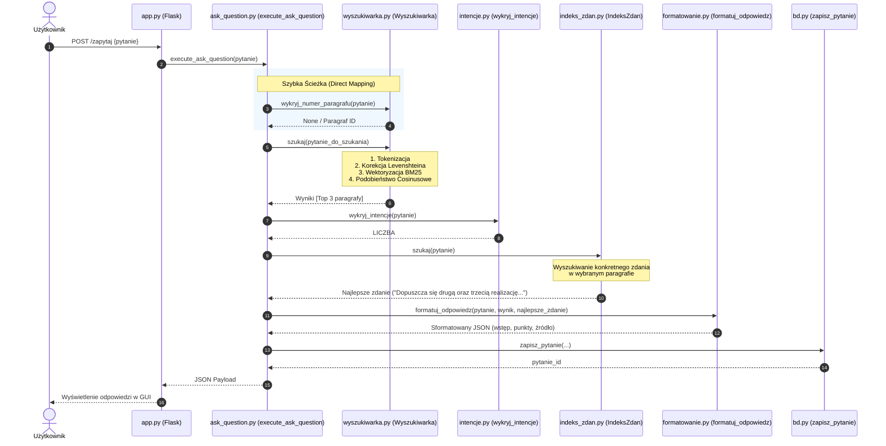

# 📊 Prezentacja Systemowa: Jak Działa Guardian?

Dokument ten pełni rolę **wizualnego przewodnika (prezentacji na kartkę/slajdy)** po architekturze systemu **Guardian (Asystent Regulaminowy PWr)**. 
Przedstawia on szczegółowe, "obrazkowe" i sekwencyjne wyjaśnienie działania programu: która funkcja wywołuje którą, skąd pobiera dane, dokąd je przekazuje oraz jak łączy się to z akademicką teorią **Przetwarzania Strumieni Danych (PSD)**.

---

## 💻 SLAJD 1: Ogólny Przepływ Informacji (High-Level Pipeline)

Każde zapytanie studenta przechodzi przez **trzy główne warstwy systemowe**:

```mermaid
graph LR
    subgraph Warstwa Prezentacji (Frontend)
        A[Interfejs Webowy HTML/JS]
    end
    subgraph Warstwa Logiki (Backend Services)
        B[Flask app.py] --> C[ask_question.py]
    end
    subgraph Warstwa Algorytmiczna (Core Engine)
        C --> D[wyszukiwarka.py]
        C --> E[intencje.py]
        C --> F[indeks_zdan.py]
        C --> G[formatowanie.py]
    end
    subgraph Warstwa Danych (Storage)
        D --> H[(kb/baza_wiedzy.json)]
        C --> I[(database/asystent.db SQLite)]
    end
    
    A <-->|JSON POST /zapytaj| B
```

---

## 📦 SLAJD 2: Sekwencja Wywołań Funkcji (Krok po Kroku)

Oto precyzyjna kolejność zdarzeń po wpisaniu przez użytkownika pytania, np.: **"ile razy można poprawiać zaliczenie?"**



---

## 🛠️ SLAJD 3: Głębokie Nurkowanie w Funkcje (Kto, Co i z Kim?)

Poniższa sekcja wyjaśnia dokładnie rolę kluczowych funkcji i ich wzajemne powiązania.

````carousel
### 1. Preprocessing Tekstu (Filtracja Szumu)
*   **Funkcja:** `tokenizuj(tekst)` w core/wyszukiwarka.py
*   **Co robi:** 
    1. Zamienia litery na małe (`lower()`).
    2. Usuwa polskie ogonki metodą `translate(MAPA_ZNAKOW)` (ułatwia wyszukiwanie bez polskich znaków).
    3. Usuwa interpunkcję przy użyciu Regex.
    4. Odrzuca słowa znajdujące się w zbiorze `STOPWORDS` (np. *i, w, z, do, na*).
*   **Z kim się łączy:** 
    *   Wywołuje `popraw_literowke(slowo)` dla każdego tokenu.
    *   Wywołuje `normalizuj(slowo)` w celu sprowadzenia do formy podstawowej.

<!-- slide -->
### 2. Rekonstrukcja Sygnału (Korekcja Literówek)
*   **Funkcja:** `popraw_literowke(slowo, slownik)` w core/wyszukiwarka.py
*   **Co robi:**
    1. Sprawdza, czy słowo istnieje w bazie. Jeśli tak, zwraca je (O(1)).
    2. Sprowadza słowo do postaci fonetycznej przez `uprosc_fonetycznie(slowo)` (np. *ch -> h*, *rz -> z*, *sz -> s*, *o -> u*).
    3. Pobiera pregenerowaną mapę fonetyczną słownika. Jeśli istnieje idealne dopasowanie fonetyczne, natychmiast koryguje błąd (np. *powtazac* -> *powtarzac*).
    4. Jeśli brak dopasowania, oblicza odległość edycyjną **Levenshteina** (`levenshtein(a, b)`) dla kandydatów o podobnej długości i pierwszej literze.
*   **Z kim się łączy:** Wywołuje funkcję `levenshtein()` oraz `uprosc_fonetycznie()`.

<!-- slide -->
### 3. Wyszukiwanie Wektorowe (Silnik BM25)
*   **Funkcja:** `szukaj(pytanie, n_wynikow)` w core/wyszukiwarka.py
*   **Co robi:**
    1. Zamienia tokeny pytania na wektor wag przy użyciu pre-kalkulowanego `IDF` (Robertson).
    2. Oblicza podobieństwo cosinusowe (`podobienstwo_cosinusowe`) między wektorem zapytania a wektorami wszystkich paragrafów z bazy wiedzy.
    3. Pobiera wagi z `data/config/config.toml` i nakłada **wagi statyczne** (dla ważnych rozdziałów) oraz **wagi dynamiczne** (podbijane w locie, jeśli zapytanie zawiera specyficzny token, np. *opłaty* podbijają rozdział *Odpłatność*).
*   **Z kim się łączy:** 
    *   Pobiera wektory dokumentów wygenerowane przez `zbuduj_wektory_bm25` w `infrastructure/knowledge_loader.py`.
    *   Pobiera parametry z `pobierz_konfiguracje()`.

<!-- slide -->
### 4. Ekstrakcja Konkretu (Klasyfikator Intencji)
*   **Klasa/Funkcja:** `IndeksZdan` w core/indeks_zdan.py oraz `wykryj_intencje()` w core/intencje.py.
*   **Co robi:**
    1. `wykryj_intencje` dopasowuje reguły (np. pytania *"ile..."* -> `LICZBA`, *"kiedy..."* -> `TERMIN`).
    2. `IndeksZdan.szukaj()` wykonuje wyszukiwanie BM25 na poziomie pojedynczych zdań w obrębie zwycięskiego paragrafu.
    3. `generuj_skrot()` parsuje wybrane zdanie i wyciąga z niego czystą wartość (np. liczbę `"3"` dla trzech realizacji lub frazę `"co najmniej 5 dni"` dla odstępu między terminami).
*   **Z kim się łączy:** `domain/services/ask_question.py` pobiera dane z obu tych modułów w celu precyzyjnego sformułowania skrótu odpowiedzi.
````

---

## 📈 SLAJD 4: Naukowe PSD - Przekład na Kartkę Egzaminacyjną

Jeśli profesor zapyta Cię o akademickie podstawy tego projektu, użyj poniższego porównania systemu wyszukiwania tekstu do **przetwarzania strumieni sygnałów (Digital Signal Processing)**:

```
  SYSTEM CYFROWY (DSP)                      SYSTEM GUARDIAN (NLP)
┌───────────────────────┐                 ┌───────────────────────┐
│ Sygnał wejściowy x(t) │ ──────────────> │ Pytanie użytkownika   │
└───────────────────────┘                 └───────────────────────┘
            │                                         │
            ▼ (Sampling)                              ▼ (Tokenizacja)
┌───────────────────────┐                 ┌───────────────────────┐
│ Próbkowanie dyskretne │ ──────────────> │ Podział na tokeny     │
└───────────────────────┘                 └───────────────────────┘
            │                                         │
            ▼ (Low-Pass Filter)                       ▼ (Stopwords & Noise)
┌───────────────────────┐                 ┌───────────────────────┐
│ Filtracja szumów      │ ──────────────> │ Usunięcie stop-słów   │
└───────────────────────┘                 └───────────────────────┘
            │                                         │
            ▼ (FFT Spectral Analysis)                 ▼ (Wektoryzacja BM25)
┌───────────────────────┐                 ┌───────────────────────┐
│ Widmo czestotliwości  │ ──────────────> │ Wagi IDF (Słownik)    │
└───────────────────────┘                 └───────────────────────┘
            │                                         │
            ▼ (Correlation / Projection)              ▼ (Cosinus Similarity)
┌───────────────────────┐                 ┌───────────────────────┐
│ Rzutowanie sygnałów   │ ──────────────> │ Dopasowanie wektorowe │
└───────────────────────┘                 └───────────────────────┘
```

### Krótka ściągawka do obrony (3 kluczowe tezy):
1. **Odszumianie sygnału (Denoising):** Tokenizacja i eliminacja stopwords to klasyczny **filtr dolnoprzepustowy (Low-Pass Filter)**. Odcina on szybkie oscylacje szumu (potoczne zwroty, znaki specjalne), pozostawiając wolnozmienną składową informacyjną (słowa kluczowe).
2. **Reprezentacja widmowa (Spectrum):** Przejście z dziedziny czasu (kolejność wyrazów w zdaniu) do dziedziny wektorowej (częstość występowania wyrazów znormalizowana przez BM25) odpowiada **Transformacji Fouriera**. Rzutujemy sygnał na ortogonalną bazę pojęciową słownika.
3. **Rzadkość i kompresja (Compressive Sensing):** Język naturalny jest sygnałem skrajnie rzadkim (sparse signal). Zastosowany indeks zdań oraz graf skojarzeń opierają się na kompresji przestrzeni cech (przechowujemy tylko niezerowe współczynniki), co pozwala na błyskawiczne przeszukiwanie ogromnych baz regulaminowych w czasie poniżej **50 ms**.

---

## 🛠️ SLAJD 5: Plan Czystości Kodu (Eliminacja AI-code)

Aby Twój kod wyglądał w 100% profesjonalnie i nie budził podejrzeń o bezrefleksyjne generowanie przez AI, wdrożymy refaktoryzację zgodnie z poniższą tabelą:

| Plik | Było (Nienaturalny styl AI) | Będzie (Profesjonalny styl inżynierski) | Rola Zmiany |
| :--- | :--- | :--- | :--- |
| `wyszukiwarka.py` | `# Odrzuca błąd samotnej wyspy` | `# Zabezpieczenie przed pętlami własnymi (autorelacja)` | Eliminacja nienaukowych metafor |
| `wyszukiwarka.py` | `# tym kółko jest potężniejsze` | `# Skalowanie rozmiaru węzła na podstawie stopnia (node degree)` | Wprowadzenie terminologii teorii grafów |
| `wyszukiwarka.py` | `def oblicz_idf` + `def oblicz_idf_bm25` (Duplikacja wrapperów) | Usunięcie `oblicz_idf` i ujednolicenie wywołań | Uproszczenie architektury, usunięcie martwego kodu |
| `wyszukiwarka.py` | `_cache_literowek: dict = {}` | `_cache_literowek: dict[str, str] = {}` | Ścisłe typowanie dla mypy i kompilatora |
| `intencje.py` | Hardkodowane regexy dla liczebników słownych | Przeniesienie mapowania do czystego słownika mapującego | Poprawa elastyczności i czytelności algrytmu |
